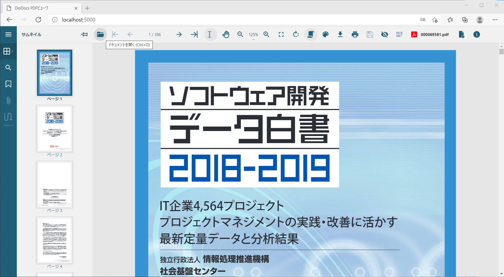

# .NET CLIを使ってPDFビューワ画面をスクラッチで作成する

https://www.grapecity.com/documents-api-pdf/docs/online/view-pdf.html に記載の方法を試してみる

## 事前準備
以下をインストールしておきます。
1. dotnet SDK
1. Node.js
1. Visual Studio Code（必須ではないがあった方が便利）

## 作成手順
実際にプロジェクトを作っていきます。

1. 新規 `ASP.NET Core Empty` アプリの作成
    >dotnet new web --no-https

1. アプリが動作することを確認する（以下のコマンドを入力し`http://localhost:5000`に移動する。Hello World!が表示されればOK）。
    >dotnet run

1. プロジェクトのルートフォルダに`wwwroot`という名前の新規フォルダを作成し移動する
    >mkdir wwwroota

    >cd wwwroot

1. `lib`という名前の新規フォルダを作成し移動する 
    >mkdir lib

    >cd lib

1. `npm`から`PDFビューワ`をインストール
    > npm install @grapecity/gcpdfviewer

1. `wwwroot`配下に`index.html`ファイルを新規作成
    > cd ..
    
    > new-item index.html

1. `index.html`を開いて以下のコードをペースト
    ```html
    <!DOCTYPE html>
        <html lang="en">
        <head>
        <meta charset="utf-8">
        <meta name="viewport" content="width=device-width, initial-scale=1, maximum-scale=1, user-scalable=no, shrink-to-fit=no">
        <meta name="theme-color" content="#000000">
        <title>DioDocs PDFビューワ</title>
        <link rel="stylesheet" href="https://cdn.materialdesignicons.com/2.8.94/css/materialdesignicons.min.css">
        <script>
            function loadPdfViewer(selector) {
                var viewer = new GcPdfViewer(selector, { /* Specify options here */ }
                );
                viewer.addDefaultPanels();
                /* viewer.open("hogehoge.pdf"); なんらかのファイルを初期表示したい場合 */
            }
        </script>
    </head>
    <body onload="loadPdfViewer('#root')">
        <div id="root"></div>
        <script type="text/javascript" src="lib/node_modules/@grapecity/gcpdfviewer/gcpdfviewer.js "></script>
    </body>
    </html>
    ```

1. `Startup.cs`内の`Configure`メソッドを以下のコードに置き換え

    ```csharp
    public void Configure(IApplicationBuilder app, IWebHostEnvironment env)
    {
        if (env.IsDevelopment())
        { 
            app.UseDeveloperExceptionPage();
        }
        app.UseRouting();
        app.UseDefaultFiles();
        app.UseStaticFiles();
    }
    ```

1. プロジェクトのルートフォルダに移動し、アプリケーションを起動
    >dotnet run


## 完成
全ての手順終了後に`http://localhost:5000`にアクセスするとビューワが表示されます。

ツールバーにあるフォルダボタンからローカルにあるPDFファイルを開くことができます。




                        